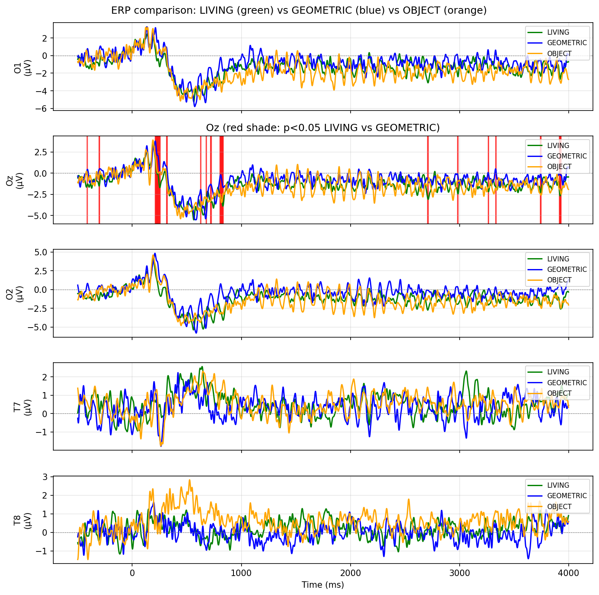
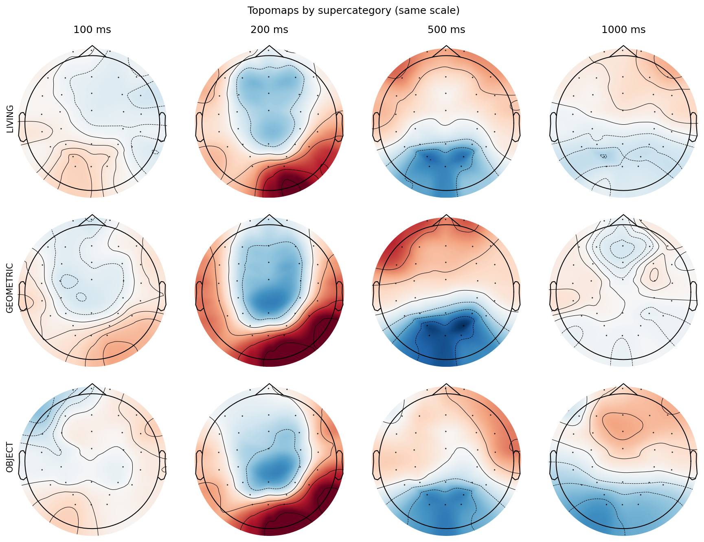
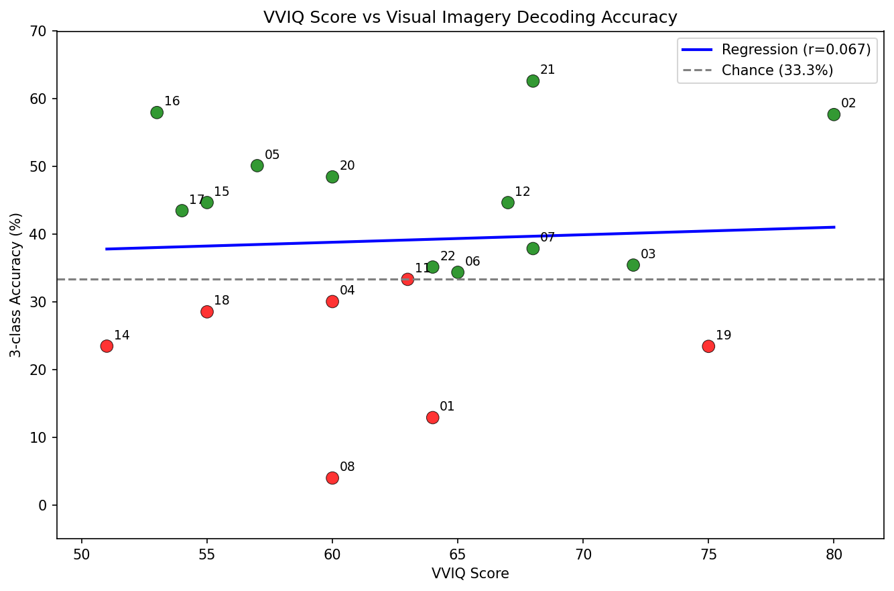

# VI-BCI: Can We Read What You're Imagining?

[](https://www.python.org/)
[](https://pytorch.org/)
[](LICENSE)
[](https://doi.org/10.6084/m9.figshare.30227503)

> **Decoding visual imagery category from scalp EEG.**
>
> When you imagine a face vs. a triangle — does your brain produce different electrical signals? This pipeline answers that using the VI-BCI dataset (22 subjects, 32 channels, 1000 Hz).

---

## The Question

Many BCI papers report high accuracy on motor imagery or perception. Visual *imagery* — closing your eyes and imagining a living thing, a shape, or an object — is harder: the signal is weaker and noisier. Can we still decode it from EEG?

This project implements a full pipeline: preprocessing → discovery visualizations → within-subject decoding → cross-subject (LOSO) decoding → and a check of whether mental imagery vividness (VVIQ) predicts decodability.

---

## Key Findings

> **The signal is real.** A measurable difference appears at occipital channels (Oz) around 200–250 ms when subjects imagine Living vs. Geometric things — consistent with known visual processing timing.
>
> **Decoding works, modestly.** Within-subject (train session 1, test session 2): **37.28% mean accuracy** on 3-class (Living / Geometric / Object). Chance is 33.3%. **12 of 19 subjects** decode above chance.
>
> **Cross-subject generalization is hard.** Leave-one-subject-out accuracy drops; domain shift across people is the main limit.
>
> **VVIQ does not predict accuracy.** Correlation between vividness-of-imagery score and 3-class accuracy is **r ≈ 0.07** — essentially zero.

---

## Results

### ERP and topomaps

Grand-average ERPs on occipital channels (O1, Oz, O2) and temporal (T7, T8); Living vs. Geometric vs. Object. The clearest separation is at Oz around 200–250 ms.



*Grand-average ERPs for Living / Geometric / Object. Significance shading on Oz.*

Scalp topomaps at 100, 200, 500, 1000 ms for the three supercategories.



*Topomaps at selected latencies for Living, Geometric, Object.*

### VVIQ vs decoding accuracy

Does vivid mental imagery (VVIQ score) predict how well we can decode? No — scatter and regression show no meaningful relationship.



*VVIQ score vs 3-class decoding accuracy. Chance line at 33.3%.*

### Summary

| Metric | Result |
|--------|--------|
| Within-subject 3-class accuracy | 37.28% mean (chance: 33.3%) |
| Subjects above chance | 12 / 19 |
| Cross-subject LOSO | Lower — domain shift |
| VVIQ vs accuracy | r ≈ 0.07 (no relationship) |
| Key EEG window | Living vs Geometric at Oz, ~208–257 ms |

---

## What's in the Pipeline

**Preprocessing** (`preprocess_all.py`) — Load raw BDF, band-pass 1–40 Hz, notch 50 Hz, ICA (Fp1/Fp2 proxy for blinks), epoch 4.5 s, reject bad trials. Writes `.fif` epochs to `outputs/preprocessed/`.

**Discovery** (`visualize_discovery.py`) — ERPs, topomaps, time–frequency (alpha/beta), channel importance. Uses sub-01; writes `outputs/figures/` and `outputs/logs/phase3_findings.txt`.

**Within-subject decoder** (`within_subject_decoder.py`) — Train on session 1, test on session 2 per subject. Transformer; optional Euclidean Alignment. Reports 10- and 3-class accuracy to `outputs/logs/within_subject_results.txt`.

**Cross-subject decoder** (`train_decoder.py`) — LOSO: train on 21 subjects, test on held-out. Heavier; use `colab_pipeline.ipynb` on Kaggle (GPU) for full run. Optional `--ea` for Euclidean Alignment.

**VVIQ correlation** (`vviq_correlation.py`) — Joins `dataset/participants.tsv` (VVIQ score) with within-subject results; Pearson r, median-split, scatter plot → `outputs/figures/vviq_scatter.png`.

---

## How to Reproduce

### 1. Clone and install

```bash
git clone https://github.com/youssof20/visual-imagery-eeg-decoding.git
cd visual-imagery-eeg-decoding
pip install -r requirements.txt
```

### 2. Download data

- **VI-BCI dataset:** [Figshare DOI 10.6084/m9.figshare.30227503](https://doi.org/10.6084/m9.figshare.30227503)
- Place contents so raw BDF and events TSV sit under `dataset/subjects/` (see dataset README for layout).

### 3. Run the pipeline (local)

```bash
python preprocess_all.py full              # Preprocess all 22 subjects
python visualize_discovery.py             # ERPs, topomaps, TFR, channel importance
python within_subject_decoder.py          # Within-subject accuracy
python vviq_correlation.py                # VVIQ vs accuracy, scatter
```

### 4. Cross-subject (Kaggle, optional)

- Upload **preprocessed** `.fif` files from `outputs/preprocessed/` as a Kaggle dataset (all files at dataset root, no subfolders).
- Open `colab_pipeline.ipynb` on Kaggle, set `KAGGLE_DATASET_SLUG` to your dataset (e.g. `yourusername/vibci-preprocessed`), enable GPU, run all cells.
- Outputs go to `/kaggle/working/vibci_outputs/`; download from the run's Output tab.

---

## Project Structure

```
vi-bci/
├── README.md
├── requirements.txt
├── .gitignore
├── preprocess_all.py          # Filter, ICA, epoch, reject → .fif
├── visualize_discovery.py     # ERPs, topomaps, TFR, channel importance
├── within_subject_decoder.py  # Train ses-1, test ses-2 per subject
├── train_decoder.py           # LOSO cross-subject decoder (CPU/Kaggle)
├── train_decoder_model.py     # EEGTransformer definition
├── align_subject.py           # Euclidean Alignment helpers
├── vviq_correlation.py        # VVIQ vs accuracy
├── colab_pipeline.ipynb       # Full LOSO on Kaggle (GPU)
├── dataset/                   # Data from Figshare (not in repo)
└── outputs/
    ├── preprocessed/         # .fif epochs (gitignored)
    ├── figures/               # PNGs (erp_comparison, topomaps, vviq_scatter, etc.)
    ├── logs/                  # Text logs (gitignored)
    └── models/                # Checkpoints (gitignored)
```

---

## Limitations

- **Single dataset:** VI-BCI only; other populations or tasks may differ.
- **Modest accuracy:** 37% is above chance but far from practical BCI.
- **Cross-subject:** LOSO shows clear domain shift; no out-of-the-box generalization to new users.
- **VVIQ:** No evidence that self-reported imagery vividness helps decoding with this setup.

---

## Citation

If you use this code or pipeline, please cite:

**Youssof Sallam.** VI-BCI: Visual Imagery EEG Decoding (2026). GitHub.

https://github.com/youssof20/visual-imagery-eeg-decoding

Dataset: VI-BCI, Figshare DOI [10.6084/m9.figshare.30227503](https://doi.org/10.6084/m9.figshare.30227503).

---

## Licence

MIT (see [LICENSE](LICENSE)).
